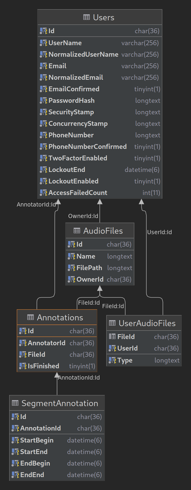

# Annotation Service

## Important Note
This README is not up-to-date, and the architecture does not conform to what is written here. There is some code refactoring to be done. I will work on these issues, once I have got time.

## Requirements

1. The `User` can register via e-mail and password.
2. Upon registration, the `User` receives a confirm mail with a confirmation link.
3. The `User` can log in if the registration has been confirmed.
4. The `User` can upload 'AudioFile's in .wav and .mp3 format. 
5. The `User` can share 'AudioFile's with other registered users. The user enters the e-mail of the user to invite. 
6. The `User` can see an overview of the uploaded and shared 'AudioFile's. An entry in the overview page should contain 
   - file name
   - whether the file is owned or shared, 
   - how many `Annotation`s it has
7. The `User` can select an audio file (owned or shared) in order to annotate it.
8. The `User` can view the amplitude over time of a selected audio file.
9. The `User` can switch to a spectrogram representation of the audio file.
10. The `User` can play a selected audio file. The progress of playback should be synchronized with the amplitude plot/spectrogram.
11. The `User` can create an `Annotation` for a file. 
12. An `Annotation` consists of `SegmentAnnotation`'s.
13. A `SegmentAnnotation` consists of 
    - `SegmentStart` which is a time interval
    - `SegmentEnd` which is a time interval
    - Label (bird class)

## Needed (and noteworthy) Components
- Relational Database (MariaDB)
- SMTP-Server (SendGrid as service, or self-hosted -> may lead to spam issues)
- IdentityServer (handles issuing of JWT Tokens for authentication)
  - the 100% free version lacks support from november 2022 onwards
  - the new version is supported by Duende and has a community license, which is free up to 1M gross revenue

## Class Diagram
This view is extracted from the database:



## Deployment

### Server and Network Infrastructure
We rely on docker-compose for deployment on a single server. 
The compose-file will spin up four containers:

- nginx server
- the web app
- a MariaDB server
- a ClamAV server

Only nginx and MariaDB will be exposed to the host network. 
Otherwise nginx is used to route within the docker-network.

The only external service used, is any SMTP-Server, 
which is not under our control.

#### Diagram


### Docker-Compose
With docker and docker-compose installed, run the following commands:

```shell
git clone https://gitlab.hrz.tu-chemnitz.de/s4050313--tu-dresden.de/annotation-service.git
cd annotation-service
```

Create certificates for use with data protection and identity server. Run the following commands:

```shell
mkdir certs
cd ./certs

openssl genrsa 2048 > private.key
openssl req -new -x509 -nodes -sha1 -key private.key > public.cer
openssl pkcs12 -export -in public.cer -inkey private.key -out data-protection-cert.pfx
rm public.cer
rm private.key

openssl genrsa 2048 > private.key
openssl req -new -x509 -nodes -sha1 -key private.key > public.cer
openssl pkcs12 -export -in public.cer -inkey private.key -out identity-server-cert.pfx
rm public.cer
rm private.key
```


Create a file `.env.dev` or `.env.prod` with the following content

```dotenv
mariaRootPassword=<the root password>
appUser=<the app user>
appUserPassword=<the app user password>

is4certPassword=<password used for creating identity-server-cert.pfx>
dataProtectionCertPassword=<password used for creating data-protection-cert.pfx>

# for use with smtp server / production -> .env.prod
smtpHost=<outbound mail server>
smtpPort=587
smtpDeliveryMethod=Network
smtpFromEmail=<mail>
smtpFromName=Annotation Support
smtpUserName=<username>
smtpPassword=<password>


# for writing files as .eml to disk or alternatively use smtp server / development -> .env.dev
smtpHost=localhost
smtpDeliveryMethod=SpecifiedPickupDirectory
smtpPickupDirectoryLocation=mails
smtpFromEmail=support@annotation.de
smtpFromName=Support
```

Run the following command to start the service up. Replace {env} with the appropriate environment
```shell
docker-compose -f docker-compose.yml -f docker-compose.{env}.yml --env-file .env.{env} up --force-recreate --build
```
If you want to detach from the console after starting up, run: 

```shell
docker-compose -f docker-compose.yml -f docker-compose.{env}.yml --env-file .env.{env} up -d --force-recreate --build
```

Navigate to http://localhost:5000

Cert for Nginx
```shell
mkcert -cert-file skoruba.local.crt -key-file skoruba.local.key skoruba.local *.skoruba.local
mkcert -pkcs12 skoruba.local.pfx skoruba.local *.skoruba.local
```
